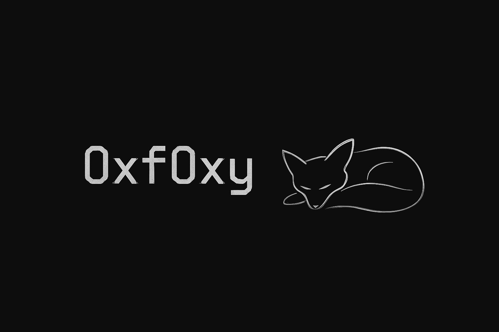

<em>"Always quiet, never lost.”</em>

  
  
  

 

---
## > About Me
> Well, you found this profile.  
> That already tells me something about you.  
>
> So now, let me tell you something about me:  
> I'm not chasing fame or glory —  
> I'm here because I like this world.  
> 
> At first, hacking was just a way to disconnect from reality,  
> a challenge to silence the chaos within.  
> But now, it’s a passion that keeps me going.  
>
> I learn by breaking.  
> I grow by solving.  

 

## > Projects
- 🌙 [LUNA](https://github.com/0xf0xy/LUNA)  
  >   
  > *A smart wordlist generator for brute-force attacks.*

- 🧠 [Write-ups](https://github.com/0xf0xy/write-ups)  
  >     
  > *CTF walkthroughs and notes — because learning is remembering where you failed.*

<!-- - 🦑 [Kraken](https://github.com/0xf0xy/Kraken)  
  > *An experimental exploit for KRACK (Key Reinstallation Attack) on WPA2.*

- 🌹 [Poems](https://github.com/0xf0xy/Poems)  
  >   
  > *Poetry from my mind — echoes from the quiet moments.* -->

- More coming soon...

 

---

<em>“No matter where you are, there’s always a way out.”</em>

